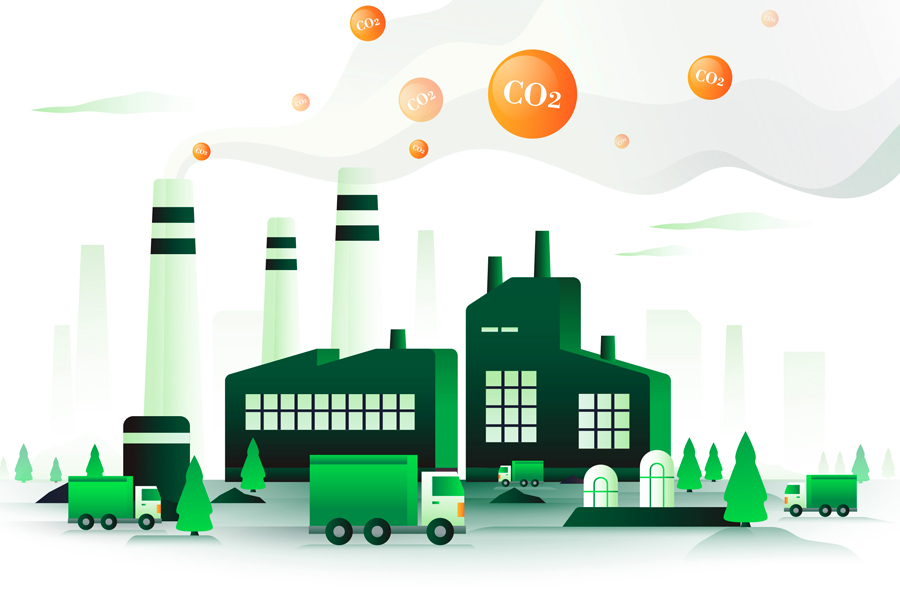

# Impact of Renewable Energy Adoption on U.S. Carbon Emissions


## Project Overview  
This project investigates the relationship between renewable energy adoption across different sectors and states in the U.S. and its impact on carbon dioxide (CO₂) emissions. The goal is to analyze trends, uncover correlations, and provide actionable insights to support sustainable development strategies.

---

### **Datasources**

### **Datasource 1:** Renewable Energy Consumption in the U.S.
- **Metadata URL:** [Renewable Energy Metadata](https://www.kaggle.com/datasets/alistairking/renewable-energy-consumption-in-the-u-s)
- **Data URL:** [Renewable Energy Data](https://www.kaggle.com/datasets/alistairking/renewable-energy-consumption-in-the-u-s?resource=download)
- **Data Type:** CSV

### **Datasource 2:** CO₂ Emissions in the U.S.
- **Metadata URL:** [CO₂ Emissions Metadata](https://www.kaggle.com/datasets/abdelrahman16/co2-emissions-usa)
- **Data URL:** [CO₂ Emissions Data](https://www.kaggle.com/datasets/abdelrahman16/co2-emissions-usa)
- **Data Type:** CSV
Both datasets are preprocessed and stored in a SQLite database (`renewable_energy.sqlite3`) for analysis.  
---
### **Reports and Presentation:**

[**Data Report**](project/data-report.pdf)

[**Project Report**](project/data_exploration.ipynb)

[**Presentation Slides**](project/slides.pdf)

[**Presenation Video Link**](project/presentation-video.md)

---
## Tools and Technologies Used  
- **Programming**: Python (Pandas,matplotlib, seaborn, SQLite, Plotly, Dash)  
- **Visualization**: Plotly, Dash Bootstrap Components  
- **Automation**: GitHub Actions  
- **Database**: SQLite  

## Directory Structure
```
project/
├── .github/
│   └── workflows/
│       └── CI.yml         # GitHub Actions workflow for CI
├── pipeline.sh            # Script to run the data pipeline
├── tests.sh               # Script to validate the pipeline and tests
├── system-test.py         # System tests for the data pipeline
├── dashboard.py           # Dashboard for visualization
├── requirements.txt       # Python dependencies
├── data/                  # Directory to store datasets and database
└── pipeline.py            # Main pipeline logic
```
---
## Installation and Setup  
 ```bash
## Clone the repository
git clone https://github.com/Ghulam-Rabbani-Azeem/Data_Engineering_Project.git

## Navigate to the project folder
cd Project
python -m venv .venv
source .venv/bin/activate   # For Unix/MacOS
.venv\Scripts\activate      # For Windows

## Install dependencies
pip install -r requirements.txt
## To execute the data pipeline, run:
sh pipeline.sh
## To validate the pipeline, execute:
sh tests.sh

```
# Data Pipeline and Testing  

## Data Pipeline [here](/project/pipeline.py)  
The automated data pipeline is designed to streamline the data preparation process for analysis and visualization. It performs the following tasks:  

1. **Data Download**: Retrieves renewable energy and emissions datasets.  
2. **Data Cleaning and Transformation**: Processes the data by addressing inconsistencies, filling missing values, and ensuring proper formatting.  
3. **Database Loading**: Stores the cleaned and transformed data into an SQLite database for efficient querying and analysis.  

---
## Testing Suite [here](/project/system-test.py)  
The `system-test.py` script ensures the reliability of the data pipeline by validating essential components. It includes:  

- **Data Directory Verification**: Ensures the `data` directory exists.  
- **Dataset Availability Check**: Confirms that all required datasets are present and readable.  
- **Database Integrity Validation**: Verifies the successful creation of the SQLite database and checks its content to ensure accuracy.  

---
## Automated Workflow [here](.github/workflows/CI.yml)  
The automated GitHub Actions workflow adds robustness to the project by performing these tasks on every code change:  

1. **Dependency Installation**: Installs the required libraries and sets up the Python environment.  
2. **Pipeline and System Tests**: Executes the `test.sh` script to validate the pipeline and perform system-level checks.  
3. **Kaggle API Integration**: Sets up Kaggle credentials for automatic dataset downloads.  

---
# Renewable Energy Dashboard  

## Key Features  

- **Dynamic Data Filtering**: Enables users to select specific states, sectors, and years to refine the displayed insights.  
- **Interactive Visualizations**:  
  - **KPI Cards**: Displays metrics such as total renewable energy usage and the data range available for analysis.  
  - **Trends Graph**: Shows renewable energy consumption trends over time by type.  
  - **Sector-Wise Distribution**: A pie chart visualizing energy usage by sectors.  
  - **State Comparisons**: Grouped bar charts for comparing state emissions and renewable energy usage.  
  - **Yearly Energy Data**: Highlights renewable energy trends on an annual basis.  

---
## Technologies Used  

- **Dash**: Framework for building interactive web-based applications.  
- **Plotly**: Library for creating dynamic and detailed visualizations.  
- **Dash Bootstrap Components**: Provides responsive and aesthetic UI styling.  
---
## Command to execute the dashboard
python dashboard.py
## Author
This project is done by Ghulam Rabbani
## License
This project is licensed under the CC0-1 Universal License - see the [LICENSE.md](LICENSE) file for details.
